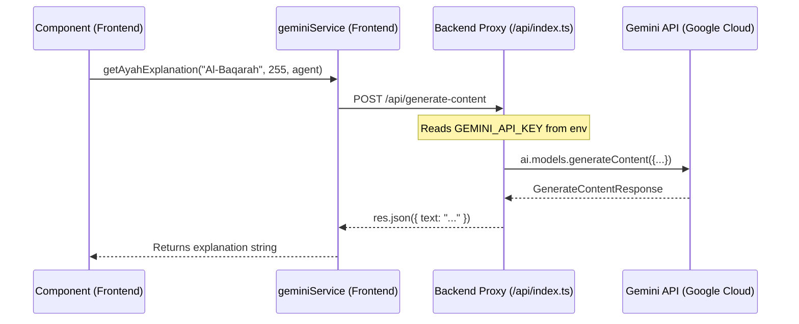
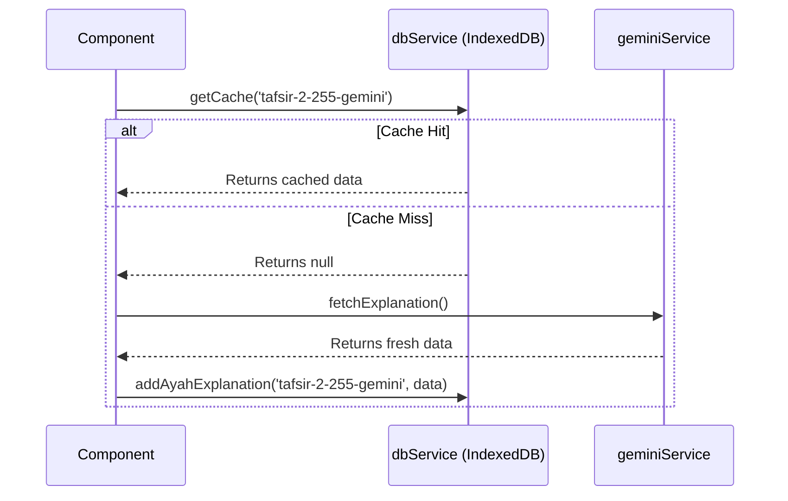

# 🕌 QuranPulse - Architecture Overview

**Version: 1.0**  
**Last Updated: October 25, 2025**

This document provides a comprehensive technical overview of the QuranPulse application's architecture. It is intended for developers to understand the core principles, data flows, and design decisions that govern the system.

## 1. Core Architectural Principles

QuranPulse is a **Client-Side Rendered (CSR) Single Page Application (SPA)** built with React and TypeScript. It follows a "no-build-step" development paradigm using modern browser features like import maps. Its architecture is built upon several key principles to ensure stability, security, and performance.

### 1.1 Secure API Proxy (Backend-for-Frontend)
All communication with external AI services (Google Gemini) is handled through a serverless backend proxy (`/api/index.ts`).

-   **Security:** The `GEMINI_API_KEY` is stored exclusively on the server as an environment variable (`process.env.GEMINI_API_KEY`), never exposed to the client. This is the single most important security principle of the application.
-   **Abstraction:** The client-side `geminiService.ts` makes simple requests to our own backend (e.g., `/api/generate-content`), which then handles the complexity of interacting with the `@google/genai` SDK.
-   **Control:** The backend implements rate limiting (`express-rate-limit`) to prevent API abuse and control costs.



### 1.2 State-Driven Manual Routing
The application **does not use a routing library** like React Router. Navigation is managed manually through a central state variable in `App.tsx`.

-   **Simplicity:** The `activeView` state (`useState<ActiveView>`) determines which feature component is rendered.
-   **Control:** The `renderActiveView()` function acts as a switchboard, mounting and unmounting components based on the `activeView` value.
-   **Scalability:** New features are added by extending the `ActiveView` enum and adding a new `case` to the switch statement.

```mermaid
graph TD
    A[App.tsx State] -- activeView: 'quran-reader' --> R{renderActiveView()}
    A -- activeView: 'prayer-times' --> R
    A -- activeView: 'ai-companion' --> R

    R -- "case 'quran-reader'" --> QR[<QuranReader />]
    R -- "case 'prayer-times'" --> PT[<PrayerTimes />]
    R -- "case 'ai-companion'" --> AIC[<AICompanion />]

    subgraph User Interaction
        B1[Sidebar Clicks]
        B2[BottomNavBar Clicks]
    end

    B1 -- setActiveView('prayer-times') --> A
    B2 -- setActiveView('quran-reader') --> A
```

### 1.3 Performance-First Approach
Performance is a core feature, achieved through several key techniques.

-   **Code Splitting:** All major feature components are lazy-loaded using `React.lazy()` and `<Suspense>` in `App.tsx`. This dramatically reduces the initial bundle size and improves the Time-to-Interactive (TTI).
-   **Offline Caching:** All AI-generated content and large static assets (like `iqraData.json`) are cached in **IndexedDB** via `dbService.ts`. This prevents redundant API calls, saves costs, and enables offline functionality.
-   **Memoization:** Expensive list items, such as `AyahView`, are wrapped in `React.memo` to prevent unnecessary re-renders.



### 1.4 Service Layer Abstraction
Components remain clean and focused on UI by delegating data and business logic to a dedicated service layer.

-   `services/geminiService.ts`: Handles all communication with the backend proxy.
-   `services/dbService.ts`: Provides simple `get`, `add`, `put` methods for all IndexedDB interactions.
-   `hooks/`: Encapsulate complex, stateful logic (e.g., `useQuranData`, `useAutoplay`, `useSpeechRecognition`).

## 2. Technology Stack

### Frontend
-   **Framework:** React 18 + TypeScript
-   **Build:** No build step (Vite-like dev environment via import maps in `index.html`)
-   **Styling:** Tailwind CSS (CDN + JIT configuration in `index.html`)
-   **State Management:** React Hooks (`useState`) and Context API (`AudioContext`).
-   **Routing:** Custom state-based router in `App.tsx`.
-   **Client-side Storage:** IndexedDB (via `dbService.ts`) for caching, `localStorage` for user settings.

### Backend (Serverless BFF)
-   **Platform:** Vercel Serverless Functions
-   **Framework:** Express.js
-   **Core Logic:** Handles secure API key management, rate-limiting, and acts as a proxy to the Google Gemini API.

### APIs & Data
-   **AI:** Google Gemini API (`gemini-2.5-pro`, `gemini-2.5-flash`, etc.) via `@google/genai` SDK (server-side).
-   **External Data:** `api.alquran.cloud` (Quran text), `api.aladhan.com` (Prayer times), `everyayah.com` (Audio).
-   **Static Data:** Bundled in `data/` or fetched from `public/data/`.

## 3. Project Structure

The project is organized by feature and responsibility to promote modularity and separation of concerns.

```
/
├── api/
│   └── index.ts               # Serverless Backend-for-Frontend (BFF) proxy
├── public/
│   └── data/iqraData.json     # Large static data, fetched on demand
├── src/
│   ├── components/
│   │   ├── ui/                # Reusable UI primitives (Button, Card, Badge)
│   │   ├── *Feature*.tsx      # Main feature components (QuranReader, PrayerTimes)
│   │   └── layout/            # (Conceptual) Sidebar, BottomNavBar
│   ├── context/
│   │   └── AudioContext.tsx   # Global state for the audio player
│   ├── data/
│   │   └── *.ts               # Small, bundled static data
│   ├── hooks/
│   │   └── use*.ts            # Custom hooks for complex stateful logic
│   ├── lib/
│   │   ├── utils.ts           # General utility functions (e.g., cn)
│   │   └── agents.ts          # Definitions for different AI personalities
│   ├── services/
│   │   ├── dbService.ts       # IndexedDB abstraction layer (caching)
│   │   └── geminiService.ts   # Client-side service for BFF communication
│   ├── types.ts               # Global TypeScript interfaces and enums
│   ├── App.tsx                # Main application component (layout, routing)
│   └── index.tsx              # React application entry point
├── architecture.md            # This document
├── index.html                 # The single HTML page (shell)
└── ...
```

## 4. Key Data & Logic Flows

### Application Bootstrapping
1.  Browser loads `index.html`.
2.  The `importmap` script tag configures module resolution paths for libraries like `react`.
3.  The main application script, `/index.tsx`, is loaded as a module.
4.  `ReactDOM` renders the `<App />` component into the `#root` div.
5.  The `App` component initializes its state, including the default `activeView`, and renders the initial UI.

### Global Audio Playback
-   An `AudioProvider` wraps the entire application in `index.tsx`, creating a single, persistent `AudioContext`.
-   Any component can call the `useAudioPlayer()` hook to access playback controls (`playTrack`, `stop`, etc.).
-   The `GlobalAudioPlayer` component, located in the main header, also uses this hook to display the current track's status and controls. This decouples the audio player's UI from the component that initiated the audio.

### Styling and Theming
-   Tailwind CSS is loaded from a CDN.
-   A custom theme is defined using CSS variables (`--background`, `--primary`, etc.) in a `<style>` block within `index.html`.
-   A `.dark` class theme is also defined.
-   The `theme` state in `App.tsx` toggles the `.dark` class on the `<html>` element, which causes the CSS variables to switch, instantly changing the application's theme.

## 5. Development Protocol & Stability

To maintain the stability of a production application, a strict protocol is followed.

-   **Protected Files:** Core, stable files (services, hooks, `App.tsx`) are considered "protected" and should not be modified without strong justification and approval.
-   **Composition over Modification:** New features should be built by creating new components and hooks that *use* existing services, rather than changing them.
-   **Pattern Adherence:** All new development must follow the established architectural patterns (state-driven routing, BFF proxy, service layer, caching) to ensure consistency and prevent architectural drift.
